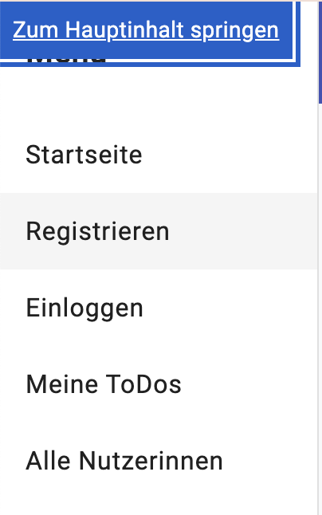
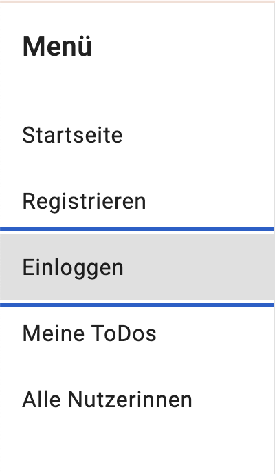

# Besondere Kapitel der Informatik: Webtechnologien II - Barrierefreie Webentwicklung

## Inhaltsverzeichnis
1. [Allgemeine Informationen](#allgemeine-infos)
2. [Allgemeine Anforderungen](#infos-zur-anwendung)
   - [Semantisches Markup](#semantisches-markup)
   - [Sprache im Dokument](#sprache-im-dokument)
   - [Skip-Link](#skip-link)
   - [Tastaturbedienbarkeit](#tastaturbedienbarkeit)
   - [Fokusring](#fokusring)
3. [Erfolgskriterien](#erfolgskriterien)
   - [Erfolgskriterium 1.1.1 „Nicht-Text-Inhalt“](#erfolgskriterium-111-nicht-text-inhalt)
   - [Erfolgskriterium 1.3.1 „Info und Beziehungen“](#erfolgskriterium-131-info-und-beziehungen)
   - [Erfolgskriterium 1.4.3 „Kontrast (Minimum)“](#erfolgskriterium-143-kontrast-minimum)
   - [Erfolgskriterium 2.4.11 „Fokus-Optik“](#erfolgskriterium-2411-fokus-optik)
   - [Erfolgskriterium 2.5.8 „ Zielgröße“](#erfolgskriterium-243-fokusreihenfolge)
   - [Erfolgskriterium 4.1.2 „Name, Rolle, Wert“](#erfolgskriterium-412-name-rolle-wert)

---

## 1. Allgemeine Informationen

Diese README-Dokumentation bietet eine Übersicht über die Implementierung der Barrierefreiheitskriterien in der ToDoodle-Anwendung und die Maßnahmen, die ergriffen wurden, um eine zugängliche Benutzererfahrung zu gewährleisten.

ToDoodle ist eine webbasierte Anwendung zur Aufgabenverwaltung. Nutzer können Aufgaben erstellen, bearbeiten, löschen und ihren Status aktualisieren. Die Anwendung bietet eine übersichtliche Benutzeroberfläche mit Funktionen wie Fälligkeitsdatumssetzung und Benutzerverwaltung.

---

## 2. Allgemeine Anforderungen

### 2.1 Semantisches Markup
Es wurden semantische HTML5-Elemente verwendet, um den Inhalt klar zu strukturieren und für Screenreader-Nutzer zugänglich zu machen.

**Mehrwert**: Diese semantischen Strukturen ermöglichen es assistiven Technologien, den Inhalt korrekt zu interpretieren und hierarchische Beziehungen zwischen den Elementen zu erkennen.

**Umsetzung**:
  - **Globale semantische Elemente**:

    Verwendung von `<header>`, `<main>`, und `<section>` zur klaren Gliederung des Inhalts in den jeweiligen Komponenten.
  

  - **Beispiel mytasklist.component.html:**

    Strukturierung mit `<section>`, `<header>`, `<table>`, `<thead>`, `<tbody>`, `<tr>`, `<th>`, und `<td>`.
    Diese semantisch korrekten HTML5-Elemente strukturieren die Daten sinnvoll, wobei das `scope`-Attribut in den `<th>`-Elementen sicherstellt, dass die Überschriften korrekt mit den Zellen verknüpft sind.
    Die `<table>`Elemente sind besonders nützlich, um tabellarische Daten klar zu strukturieren und zu beschreiben.
    Das `scope`Attribut in den `<th>`Elementen ist auch wichtig, um die Beziehungen zwischen Tabellenzellen und ihren Überschriften für assistive Technologien klarzustellen.


- **Interaktive Elemente**: 

  Es gibt eine klar definierte Schaltfläche, die durch ARIA-Attribute unterstützt werden, was zusätzliche Informationen für Screenreader liefert.

---

### 2.2 Sprache im Dokument
Diese Einstellung stellt sicher, dass die Sprache des Inhalts korrekt erkannt wird, was sowohl für Suchmaschinen als auch für Barrierefreiheitsfunktionen wichtig ist.

**Umsetzung:**

In der `index.html`-Datei ist die Sprache des Dokuments auf Deutsch festgelegt. Dies wird durch das `lang`-Attribut im `<html>`-Tag angezeigt, das auf `"de"` gesetzt ist:
```html
<html lang="de">
```

---

### 2.3 Skip-Link
Ein Skip-Link wurde integriert, um es Nutzern zu ermöglichen, die Navigation zu überspringen und direkt zum Hauptinhalt zu springen.

**Mehrwert:** Der Skip-Link erleichtert Nutzern mit Screenreadern und Tastaturnutzern die Navigation und reduziert die Zeit, die zum Erreichen des Hauptinhalts benötigt wird.

**Umsetzung**:

Implemntierung in der nav.component.html
```html
<a [attr.href]="skipLinkHref" class="skip-link" tabindex="0" (click)="skipToContent()" aria-label="Zum Hauptinhalt springen">Zum Hauptinhalt springen</a>
```



---

### 2.4 Tastaturbedienbarkeit
Die Benutzeroberfläche ist vollständig über die Tastatur steuerbar, einschließlich aller interaktiven Elemente.

**Mehrwert:**
Diese Implementierung ermöglicht es Nutzern mit motorischen Einschränkungen, die gesamte Anwendung ohne Maus zu bedienen.

**Umsetzung:**


- **Tastendruck-Ereignisse**: Globale Tastendruck-Ereignisse werden abgefangen und an die `KeyboardNavigation`-Klasse weitergeleitet, die die Tastatursteuerung verwaltet.


- **Tab-Navigation**: Alle interaktiven Elemente sind mit der Tabulatortaste erreichbar, und die Rückwärtsnavigation erfolgt mit **Shift + Tab** oder **Pfeiltaste ↑**.
   Die Tabulatorreihenfolge folgt einer logischen und visuellen Struktur der Seite, um eine intuitive Navigation sicherzustellen.


- **Pfeiltasten-Navigation**: Die Navigation ist durch die Pfeiltasten ermöglicht.
    - **↑/↓**: Wechseln zwischen Elementen.
    - **←**: Setzt den Fokus auf das erste Element der Navigation (z.B. Startseite).
    - **→**: Setzt den Fokus auf das erste interaktive Element in der Hauptkomponente.
  

- **Entertaste**: Ausführen von Aktionen durch Drücken der Entertaste auf interaktiven Elementen. Formulare können durch Drücken von Enter abgeschickt werden.


- **Escape-Taste**: Modale können durch die Escape-Taste geschlossen werden.
  
---

### 2.5 Fokusring
Der sichtbare Fokusring wurde für alle interaktiven Elemente eingeführt, um klar anzuzeigen, welches Element aktuell den Fokus hat. 

**Mehrwert:** Der sichtbare Fokusring erleichtert die Tastaturnavigation und ermöglicht es Nutzern, den aktuellen Fokus schnell zu identifizieren.


**Umsetzung**:

- HTML-Anpassungen: Interaktive Elemente wie `<a mat-list-item>` erhalten durch das Hinzufügen von tabindex="0" eine sichtbare Fokusmarkierung, die ihre Tastaturnavigation verbessert.


- CSS-Anpassungen: Fokus-Stile wie `outline` für fokussierte Elemente (Links, Buttons, Inputs) hinzugefügt, um sicherzustellen, dass der Fokus-Ring sichtbar ist und die Tastaturnavigation erleichtert



---

## 3. Erfolgskriterien

### 3.1 Erfolgskriterium 1.1.1 „Nicht-Text-Inhalt“

In der **register.component.html** wurden mehrere Anpassungen vorgenommen, um sicherzustellen, dass nicht-textuelle Inhalte für Screenreader-Nutzer zugänglich sind.

**Mehrwert**: Diese Anpassungen sorgen dafür, dass Screenreader-Nutzer die Bedeutung und Funktion von nicht-textuellen Inhalten verstehen können.

**Umsetzung:**

**Textalternativen für Icons:**

  - **Irrelevante Icons:** Icons ohne funktionale Bedeutung, wie z.B. das Personen-Icon
    (`<mat-icon>person_add</mat-icon>`), sind mit `aria-hidden="true"` versehen, um zu verhindern, dass Screenreader sie vorlesen.


  - **Funktionale Icons:** Icons mit Funktion, wie z.B. das Passwort-Anzeige-Icon, verwenden dynamische `aria-label` Attribute, die den aktuellen Zustand beschreiben (z.B. „Passwort anzeigen“ oder „Passwort verbergen“).

    `aria-pressed` kennzeichnet den Zustand der Schaltfläche („gedrückt“ oder „nicht gedrückt“), was für assistive Technologien nützlich ist.

---


### 3.2 Erfolgskriterium 1.3.1 „Info und Beziehungen“

Dieses Kriterium stellt sicher, dass Informationen und Beziehungen auf einer Webseite für assistive Technologien zugänglich sind.

**Umsetzung:**
- **Formularelemente und Labels:**
  Jedes Eingabefeld ist korrekt mit einem `<label>` verknüpft, das entweder sichtbar ist oder eine „visually-hidden“-Klasse trägt, um sicherzustellen, dass Screenreader die Verknüpfung zwischen den Eingabefeldern und ihren Beschreibungen verstehen.
```html
<label for="username" class="visually-hidden">Nutzername</label>
<input matInput placeholder="Nutzername eingeben" formControlName="username" id="username">
```

- **ARIA-Attribute zur Beschreibung von Fehlern:**
  Bei Formularfehlern wie fehlendem oder ungültigem Input werden die Fehlermeldungen mit aria-describedby korrekt mit den Eingabefeldern verbunden, um sicherzustellen, dass Nutzer von Screenreadern die Fehler klar identifizieren können.
```html
<input matInput placeholder="Nutzername eingeben" formControlName="username" id="username" aria-describedby="username-error">
<mat-error id="username-error">Nutzername erforderlich</mat-error>
```

- **Zusätzliche ARIA-Attribute für interaktive Elemente:**
  Interaktive Bedienelemente wie Passwort-Visibility-Toggles und Buttons haben entsprechende ARIA-Attribute wie aria-label und aria-pressed, um die Interaktion für Screenreader-Nutzer verständlich zu machen.
```html
<button mat-icon-button matSuffix (click)="hide = !hide" [attr.aria-label]="hide ? 'Passwort anzeigen' : 'Passwort verbergen'" [attr.aria-pressed]="!hide">
```

- **Zusätzliche Beschreibungen für Screenreader**:
Ein `<small>`Element mit der Klasse `visually-hidden` wurde hinzugefügt, um zusätzliche Beschreibungen für Screenreader-Benutzer bereitzustellen. Diese Beschreibungen sind für normale Benutzer unsichtbar, aber Screenreader können sie lesen und ausgeben.

- Beispiel: Das `<small>`Element enthält Anweisungen wie „Gib eine Aufgabe ein, die erledigt werden soll.“


- **Verknüpfung von Beschreibungen mit Formularfeldern**:
  - Das `aria-describedby`Attribut wurde zu den `input`Feldern hinzugefügt, um die Verknüpfung zwischen den Formularfeldern und den zusätzlichen Beschreibungen herzustellen.
---


### 3.4 Erfolgskriterium 1.4.3 „Kontrast (Minimum)“

Das Erfolgskriterium stellt sicher, dass Text und Bilder einen ausreichenden Farbkontrast zum Hintergrund aufweisen. Die Kontrastverhältnisse in der `home.component` wurden mithilfe der Website [Accessible Colors](https://accessible-colors.com/) überprüft. 

**Mehrwert**: Durch die Verbesserung des Kontrasts wird die Lesbarkeit der Inhalte deutlich erhöht, insbesondere für Nutzer mit Sehbehinderungen.


**Umsetzung**:

- Anpassung der Schriftgrößen in css-Dokument von Überschrift und normalen Text
- Anpassung der Textplatzierung im oberen Bereich, um eine bessere Sichtbarkeit vor einem einheitlichen Hintergrund zu gewährleisten, da sich die Textpassage vorher auf unruhigen Hintergrund befand.
- Anpassung der Buttonfarbe von Grau zu Blau, da ein hellgrauer Button mit weißer Schrift nicht genug Kontrast bietet, wurde die Farbe auf Blau geändert mit weißer Schrift für einen ausreichenden Kontrast.


vorher:


nachher:

---


### 3.6 Erfolgskriterium 2.4.11 „Fokus-Optik“
Das Kriterium stellt sicher, dass der Tastaturfokus deutlich sichtbar ist, wenn die Benutzer durch eine Webseite navigieren.

**Mehrwert:** Dadurch wird die Benutzerfreundlichkeit und Zugänglichkeit der Anwendung verbessert.

**Umsetzung:** Hier musste die Fokus-Optik speziell für den Logout-Button angepasst werden, da dieser farblich nicht vom Hintergrund zu unterscheiden war und der Fokusring keinen ausreichenden Kontrast bot. Da die Fokus-Optik überall sonst ausreichend sichtbar ist, war nur beim Logout-Button eine Anpassung erforderlich

- **CSS-Anpassungen für den Fokus:**
  Der Fokus-Ring wurde durch CSS so angepasst, dass er deutlich sichtbar ist, wenn der Logout-Button fokussiert wird. Die Hintergrundfarbe ändert sich bei Fokus, um die Sichtbarkeit zu erhöhen.

```css
.logout-button:focus,
.logout-button:hover {
  background-color:#f8f9fa;
  color: #3f52b5;
}
```
vorher:


nachher:


---

###  Erfolgskriterium 2.5.8 „ Zielgröße“

Die Implementierung des Kriteriums 2.5.8 stellt sicher, dass alle interaktiven Ziele, wie Schaltflächen und Links, eine Mindestgröße von 24x24 CSS-Pixeln haben.

**Mehrwert:** Dies gewährleistet, dass sie für alle Benutzer leicht anklickbar sind, insbesondere für Personen mit motorischen Einschränkungen.

**Umsetzung:** Alle interaktiven Elemente, wie Buttons und Checkboxen, wurden in der mytasklist.html mithilfe der Webbrowser-Entwicklertools auf ihre Größe überprüft. Dabei wurden zu kleine Elemente identifiziert und angepasst.

- **Größeneinstellung:**

  Die CSS-Regeln wurden angepasst da einige interaktiven Elemente zu klein waren.

- **Zentrierung der Elemente:**

  Die Elemente wurden so gestaltet, dass sie mittig innerhalb ihrer Container platziert sind, um die Benutzererfahrung zu verbessern.


```css
td[aria-labelledby="header-optionen"] .bi-pencil-square,
td[aria-labelledby="header-optionen"] .bi-trash {
  font-size: 24px;
  width: 24px;
  height: 24px;
  cursor: pointer;
  display: inline-flex;
  align-items: center;
  justify-content: center;
  margin-right: 5px;
  margin-left: 5px;
  outline-offset: 2px;
}
```

vorher:


nachher:


---


### 3.7 Erfolgskriterium 4.1.2 „Name, Rolle, Wert“
Das Erfolgskriterium fordert, dass für alle interaktiven Elemente auf einer Webseite der Name, die Rolle und der Zustand (Wert) korrekt bestimmt und assistiven Technologien wie Screenreadern zugänglich gemacht werden.

**Mehrwert:** Dies stellt sicher, dass Nutzer von assistiven Technologien die Funktion von Bedienelementen klar verstehen und verwenden können.

**Umsetzung in der `mytasklist.component.html`:**

Beispiele:
- **Interaktive Elemente (Bearbeiten, Löschen)**
  - **Name:** Eindeutige `aria-label`Attribute für Aktionen.
  - **Rolle:** `<a>` und `<span>`Elemente.
  - **Code-Beispiel:**

      ```html
      <a aria-label="Bearbeiten Aufgabe {{ todo.aufgabe }}">
        <span class="bi bi-pencil-square"></span>
      </a>
      <span aria-label="Aufgabe {{ todo.aufgabe }} löschen"></span>
      ```


- **Zusätzliche Zelleninhalte**
  - **Name:** `aria-label` für Inhalte der Zellen.
  - **Rolle:** `<td>`Elemente.
  - **Wert:** Dynamischer Inhalt basierend auf Datenbankeinträgen.
  - **Code-Beispiel:**

    ```html
    <td aria-label="'Aufgabe: ' + todo.aufgabe">{{ todo.aufgabe }}</td>
    ```

